# The Dancing Palate
The Dancing Palate is a fictional bar in New York City, which intends to tickle your palate with new flavours and allows you to relax in a laid back setting.<br>
It is a place for young and old. Only requirement: Bring good times, a thirst for new experiences and your friends. <br>

This website is supposed to help the customer find the location, request bookings via the contact page, have a peak at the menus and draw attention to our ongoing events.

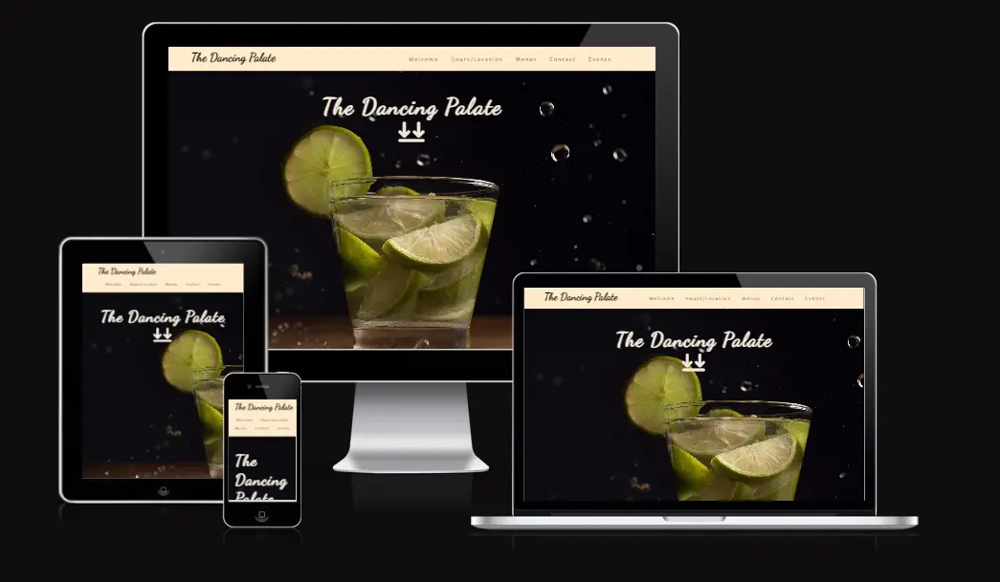

<em>The Website is already live:</em>
[HERE][def]

## Table of Contents
+ [UX](#ux "UX")
  + [Site Purpose](#site-purpose "Site Purpose")
  + [Site Goal](#site-goal "Site Goal")
  + [Audience](#audience "Audience")
  + [Communication](#communication "Communication")
  + [Current User Goals](#current-user-goals "Current User Goals")
  + [New User Goals](#new-user-goals "New User Goals")
+ [Design](#design "Design")
  + [Colour Scheme](#colour-scheme "Colour Scheme")
  + [Typography](#typography "Typography")
  + [Imagery](#imagery "Imagery")
+ [Features](#features "Features")
  + [Existing Features](#existing-features "Existing Features")
+ [Testing](#testing "Testing")
  + [Validator Testing](#validator-testing "Validator Testing")
  + [Unfixed Bugs](#unfixed-bugs "Unfixed Bugs")
+ [Technologies Used](#technologies-used "Technologies Used")
  + [Main Languages Used](#main-languages-used "Main Languages Used")
  + [Frameworks, Libraries & Programs Used](#frameworks-libraries-programs-used "Frameworks, Libraries & Programs Used")
+ [Deployment](#deployment "Deployment")
+ [Credits](#credits "Credits")
  + [Content](#content "Content")
  + [Media](#media "Media")


## UX

### Site Purpose:

To help the customer find the location, request bookings, have a peak at the menus and draw attention to our ongoing events.

### Site Goal:

To regularly update our current users with the latest information, get them to make their bookings over the website, draw attention to social media (->followers) and build a base of regular visitors.

### Audience:

Cocktail enthusiasts and those who want to become one. Our target group are all people between the ages of 21-60. 

### Communication:

With a minimalistic design,  information is easy to find by all who visit the site. With this approach we avoid an overload of information and ensure that the most important parts are conveyed to the customers. The operating hours and location are available throughout all the pages, to remind our audience immediately of when we are open and where to find us.

### Current User Goals:

- To see updates on upcoming events and changes in the menus

### New User Goals:

- to navigate the site with ease & clearly understand the information that is being provided.
- for the information to be relevant & up-to-date.
- to be inspired by a striking design that captures the potential customers immediate interest,
and keeps the focus on the site.

## Design

### Colour Scheme:

The color palette was kept very simplistic with black and #blanchedalmond (hex-code: #FFEBCD) as background colors for content and header/footer respectively. <br>
Colors come almost exclusively from the background pictures.<br>
For the text-color I used black for the header and footer. This was switched around in the main sections where I used #F4EADB (=var(--menu-color)) as the text color and made the background black. This ensures nice contrast and readibility and provides extra separation between header/footer elements and the main content. <br>

To make clickable links and menu-navigation obvious to the user all of these items turn #chocolate (hex-code #D2691E) when hovered upon. This slightly darker color also matches nicely with the #blanchedalmond background. This light brown can also be distinguished easily from the black background in the Hours/Location section.(->google maps link) <br>

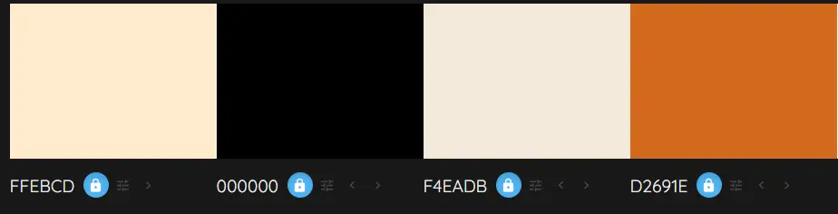

### Typography:

[Fontjoy][def4] was used to find matching fonts for the header font Dancing Script.<br>
There I chose the following 3 fonts for the website:<br>
They are declared in the :root selector in the beginning of the styles.css file:<br>
```
:root {
    --header: Dancing Script, cursive;
    --subheader: Merriweather Sans, sans-serif;
    --text: Rubik, sans-serif;
}
```

The Dancing Script font matches with the 'dancing' Theme Name of the site and gives the site an artsy and musical touch. The subheader and text fonts are simpler to make it easy to find menu elements and ensure content is easy to read. 

### Imagery:

All the images found on the website are free stock images from [Pixabay][def3]. <br>
The images were all used as backgrounds to highlight the fact this is a bar-environment with a focus on high-end cocktails, spirits and food.    

## Features

### Existing Features
#### Navigation bar:

This navigation bar is included over all 5 pages and also the form-dump page. It ensures visitors can navigate seamlessly between the pages.

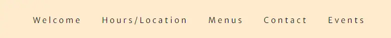

#### Footer
The footer includes the social media links and can be found on all pages to round them off.

#### Landing/Welcome Page(=index.html)

The top-part of the welcome page shows a picture of a cocktail to alert the user to what kind of website they are on.<br>
The arrow indicates where to go to see the content intended to be viewed next.There is an animation which changes between 3 different pictures. 

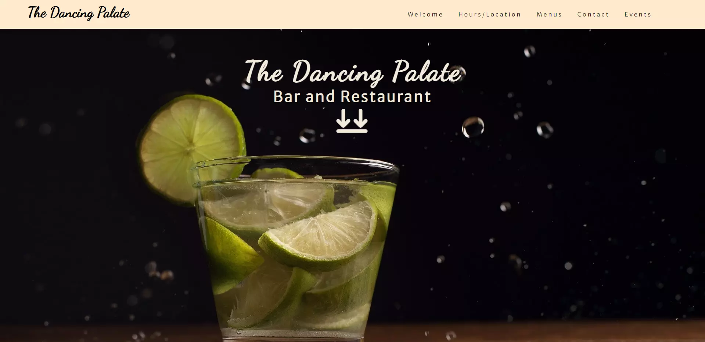

The bottom part shows a quote and describes the company philosophy. 

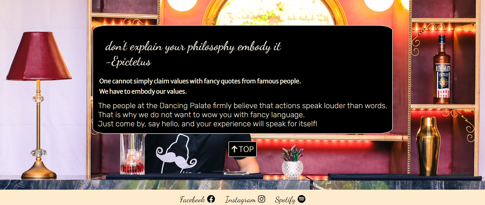

#### Hours/Location Page(=opening.html)

The top part is almost the same as the welcome page. The bottom part has the opening hours and location. 

The hours/location page informs the customer when the bar is open and where to find it. For easy access the address links to google maps when clicked on.<br>
I figured that an opening-hours/location element should be included in the navbar since it is vital information and often looked for. 
 
 
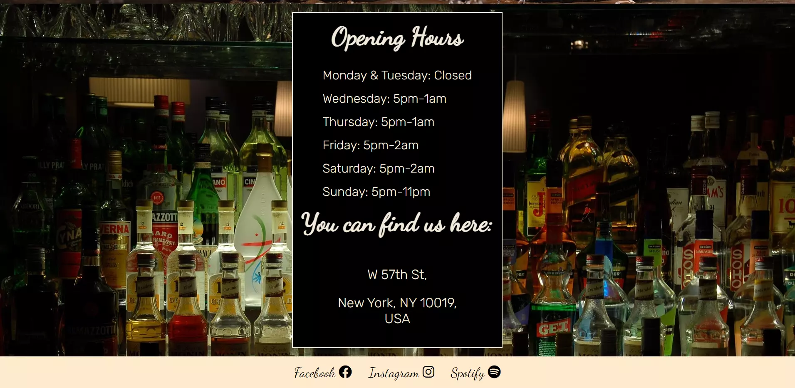

#### Menus Page(=menus.html)

Here the food and drinks menus can be found. The background picture suggests that drinks as well as food is available and part of the menu is already visible for easy access.
The top of the menu page also has an animation that switches between different background pictures. 

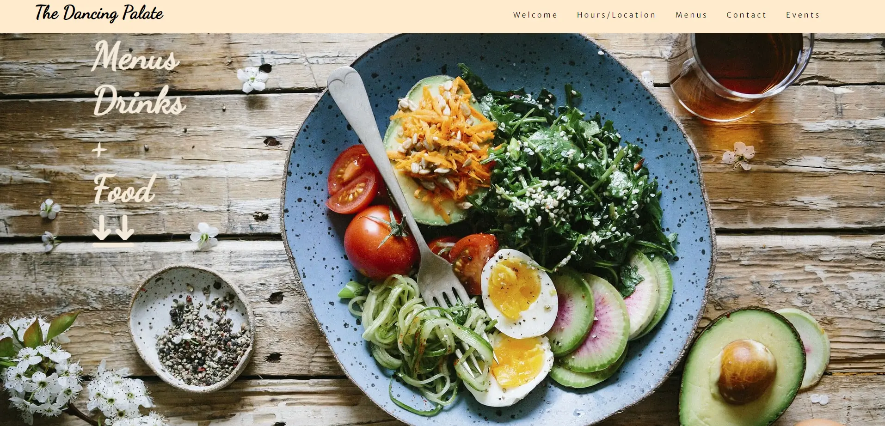
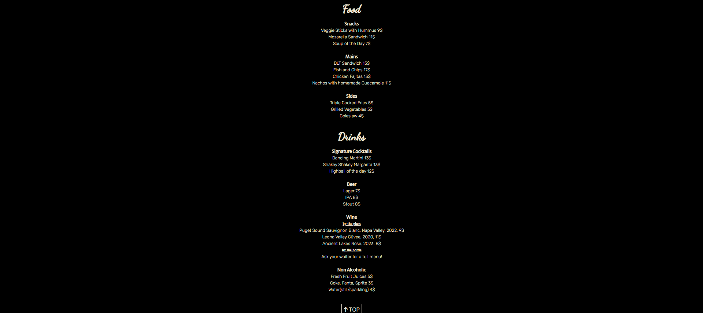

#### Contact Page(=contact.html)

The top part of the contacts page mimicks the style of the landing page.<br>
The arrows clearly indicate where to find the contact forms.

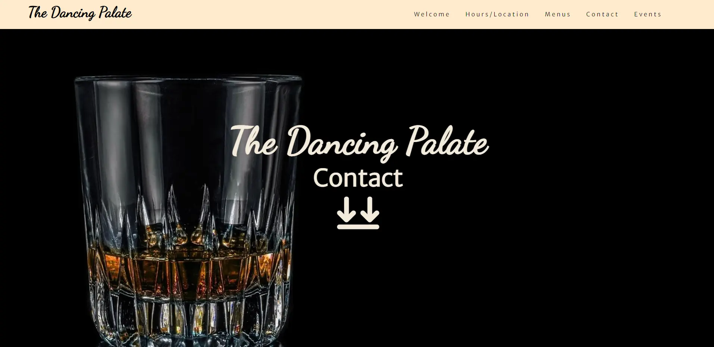

On the bottom part the Contact form as well as the signup for the newsletter can be found. 

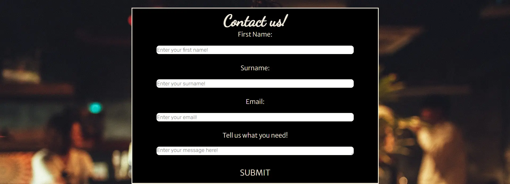
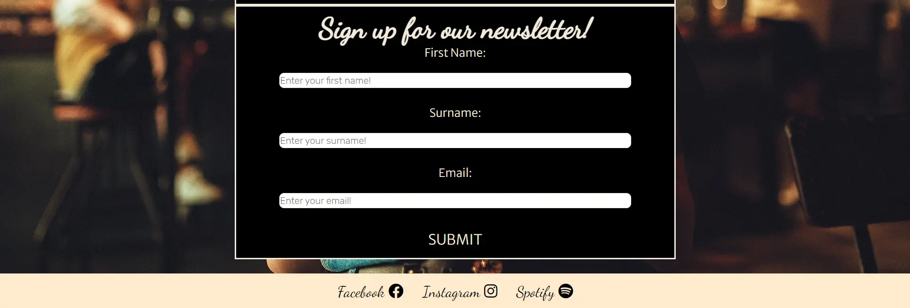

#### Form Dump(=form-destination.html)

A form dump was created to indicate the contact and newsletter form have worked: 

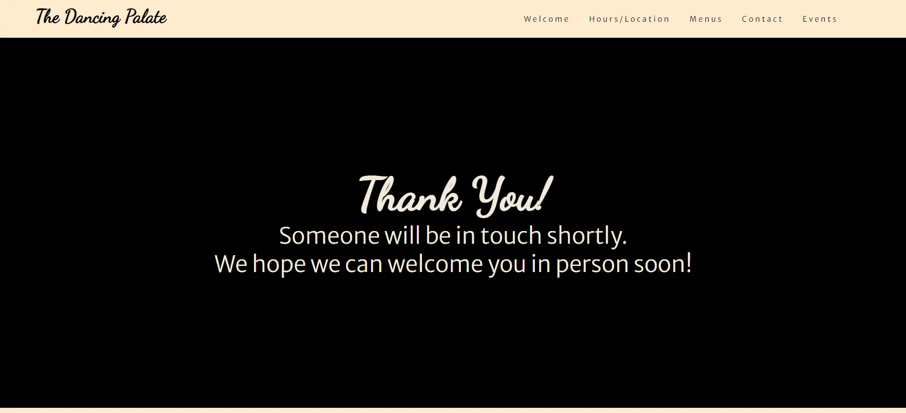

#### Events Page(=events.html)

This page shows off special and ongoing events. It clearly states when and where they are happening and gives an easy view of all the information.
The background image gives the feeling of night life and party. Also there is an audio file which plays the bars "song of the week".

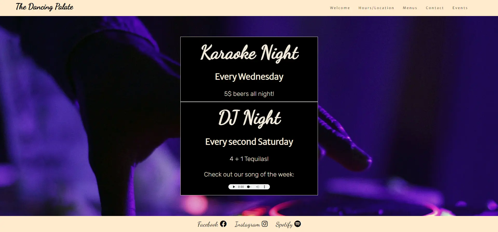

#### TOP Button

The TOP button exists on pages where the nav bar gets out of sight while scrolling. When the user reaches the bottom of the page the top button takes him back to the top. This makes navigation easier and avoids having to scroll upwards again and confusion where to get to the next content. 

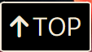

#### Error Page

When a 404 error is thrown the customer sees a custom error message with a button that returns the homepage. 

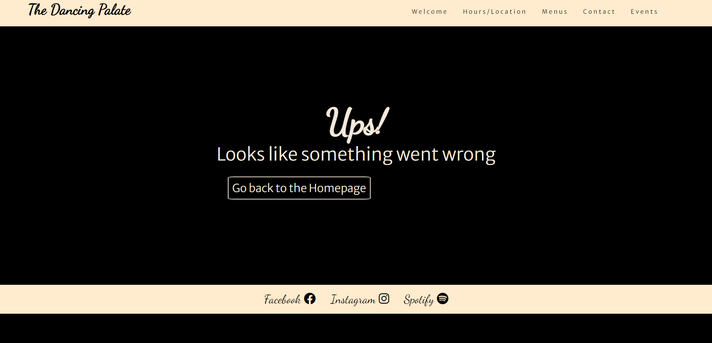

### Testing

+ I tested the page with DevTools in Chrome, Firefox and Edge and encountered no issues. <br>
+ The site is responsive and formats correctly until a width of 320px.<br>
+ The links work and open in new tabs and the forms meet the required standards. <br>

### Validator Testing

#### Lighthouse

The page has a strong overall score on lighthouse: <br>

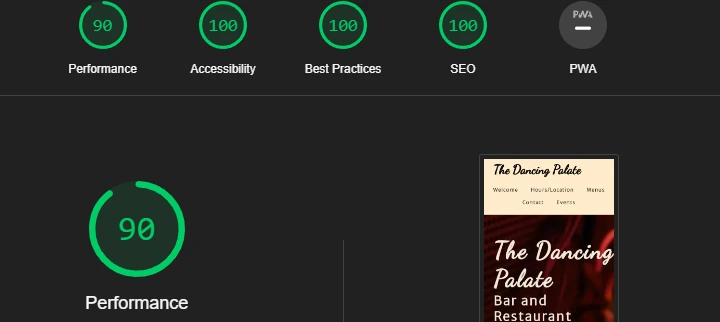

#### W3C:

The W3C Validator shows no errors except one, which was intentionally ignored. <br>
The header in question has no text, because the content is an font-awesome icon (arrow).

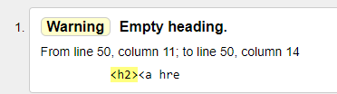

#### Jigsaw:

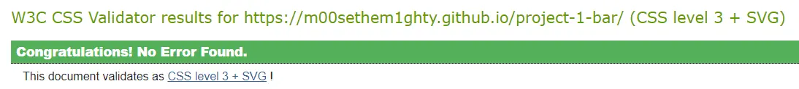

#### PageSpeedInsights:

The page has an excellent score on desktop devices (tested with [PageSpeedInsights][def5]): <br>

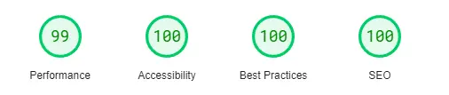

### Bugs

Sometimes some of the animations do not work correctly when looking at them with the chrome DevTools. Outside of it there are no such issues.<br>
Also the resizing of the pages when clicking on a new page while in 'responsive mode' behaves inconsistently at times.<br>
I do not believe this is a problem with my website, primarily because the issues are not consistent and appear somewhat random. <br>

I remodeled the page and moved the opening times to a seperate page, because the GitHubPages live site did not behave the same as the local version (8000 port). This issue would have needed JavaScript to be solved, if the layout would have stayed the same. 

## Technologies Used
### Main Languages Used
- HTML5
- CSS3

### Frameworks, Libraries & Programs Used
- Google Fonts - for the font families: Dancing Script, Merriweather Sans and Rubik. San-serif was used as fallback font.
- Font Awesome - to add icons to the social links in the footer element.
- GitPod - to creat my html files & styling sheet.
- GitHub - to store my repository for submission.
- Am I Responsive? - shows responsiveness over all device sizes.


## Deployment
The site was deployed to GitHub pages. The steps to deploy are as follows:
- In the GitHub repository, navigate to the Settings tab
- In the left side menu under Code and Automation find Pages and click it. 
- This opene GitHubPages. On the top you can find the link to the live page. The Visit Button brings you there automatically in a new tab. 
- The live link can be found [HERE][def] as well.

## Credits
The template for this readme and also the structure of the signup forms were taken(after asking) from my mentors project [LaLucha][def6].<br>
She also turned me onto using flexbox for styling the site. This site was used for learning the flexbox basics: [FlexBoxFroggy][def7].<br>

Thank you Lauren!

The following CSS to hide the scrollbar was taken from the web. Unfortunately I cannot find the forum it was taken from anymore.  
```
/* Hide scrollbar for Chrome, Safari and Opera */
body::-webkit-scrollbar {
    display: none;
}

/* Hide scrollbar for IE, Edge and Firefox */
body {
    -ms-overflow-style: none;
    scrollbar-width: none;
    background: black;
    display: flex;
    flex-direction: column;
    justify-content: space-between;
    flex-grow: 1;
}
```
Since I had some knowledge from certifications I did outside of CodeInstitute I did not rely much on sources from the internet. Hence the credit section is rather short. <br>
[freeCodeCamp Certification][freecode]

### Content

The design and content of this page was inpired by [Dante NYC][danteNYC].

I myself have worked almost 5 years in hospitality, so most of the content was created by me. 

### Media

Here are the free stock pictures from pixabay:

https://pixabay.com/photos/woman-coffee-phone-portrait-lady-4246954/<br>
https://pixabay.com/photos/caipirinha-brazil-drink-liquor-4782694/<br>
https://pixabay.com/photos/alcohol-bar-night-cocktail-drink-857380/<br>
https://pixabay.com/photos/flat-lay-food-salad-diet-healthy-2583212/<br>
https://pixabay.com/photos/whiskey-glass-whiskey-glass-644372/<br>
https://pixabay.com/photos/hand-turntable-dj-neon-lights-1850120/<br>
https://pixabay.com/photos/dj-songs-music-disco-equipment-2581269/<br>
https://pixabay.com/photos/spaghetti-tomatoes-basil-1932466/<br>
https://pixabay.com/photos/bread-sandwich-food-plate-toast-1867208/<br>
https://pixabay.com/photos/bartender-mixologist-bar-cocktail-5130099/

Here is the audio from pixabay:<br>
[Lofi Study Beat][study beat]
Music by <a href="https://pixabay.com/users/fassounds-3433550/?utm_source=link-attribution&amp;utm_medium=referral&amp;utm_campaign=music&amp;utm_content=112191">FASSounds</a> 

Here is the free use favicon image:

[Favicon.io][def2] was used to convert it to the right size.<br>
https://img.freepik.com/premium-vector/alcohol-cocktail-icon-comic-style-drink-glass-vector-cartoon-illustration-white-isolated-background-martini-liquid-business-concept-splash-effect_157943-7113.jpg?w=2000

[def]: https://m00sethem1ghty.github.io/project-1-bar/
[def2]: https://favicon.io
[def3]: https://pixabay.com/
[def4]: https://fontjoy.com/
[def5]: https://pagespeed.web.dev/
[def6]: https://github.com/CluelessBiker/project1-la-lucha
[def7]: https://flexboxfroggy.com/
[freecode]: https://www.freecodecamp.org/certification/MightyM00se/responsive-web-design
[danteNYC]: https://www.dante-nyc.com/
[study beat]: https://pixabay.com/music/beats-lofi-study-112191/